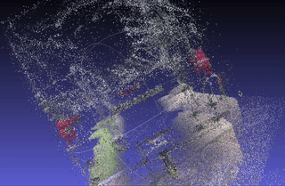

Video to Point Cloud Converter
==============================

Convert videos into 3D point clouds using COLMAP.

Description
-----------

This project extracts frames from a video, runs COLMAP to create a point cloud, and saves it in PLY format. The resulting point cloud can be imported into anything you need for visualization and further manipulation.

> *"This isn't the best example of what this can do, but the bus scan is the best I've come up with so far. Check the [examples](docs/README.md#examples) for more context."* - zbuhrer

License
-------

This project is licensed under the Apache License 2.0 - see the LICENSE file for details.
