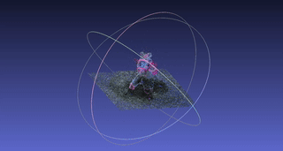

# Journal

Writing down some notes on the extractions as I do them; follow this if you want to know more.

**First Extraction:** The Bus

> *"I extracted 566k points from a 1:20 (30fps). There were a bunch of extra points in the background from details it grabbed from nearby trees and the edge of the house. You can see from the gif that only really the back of the bus came out well; the front was distorted by a bad path I took around this."* - zbuhrer

> *"In retrospect, the size of this object and scan was ambitious. I would not recommend trying to scan something that requires you move more than 10-20 linear feet in any direction. It may also not be a good idea to scan something so physically massive that the camera's perspective can't see "through" or "around" it in any meaningful way, which I think is why the highest concentrations of points are on the ground under the RV.*
>
> *"I can make this PLY downloadable if anyone really wants it."* - zbuhrer

---

**Second Extraction:** Tony The Pony

> *"This one was a big learning experience. In learning how points and meshes are processed, I've discovered how to apply multiple filters programmatically to the pointcloud captured. This is going to help me tweak my application to understand some things. "*

**Third Extraction:** Daisy's Rock Garden.

> *"I had a lot of fun with this one, especially because I got to play with how I'm calculating the quality. For all intents and purposes, I am attempting to recreate these settings."*

